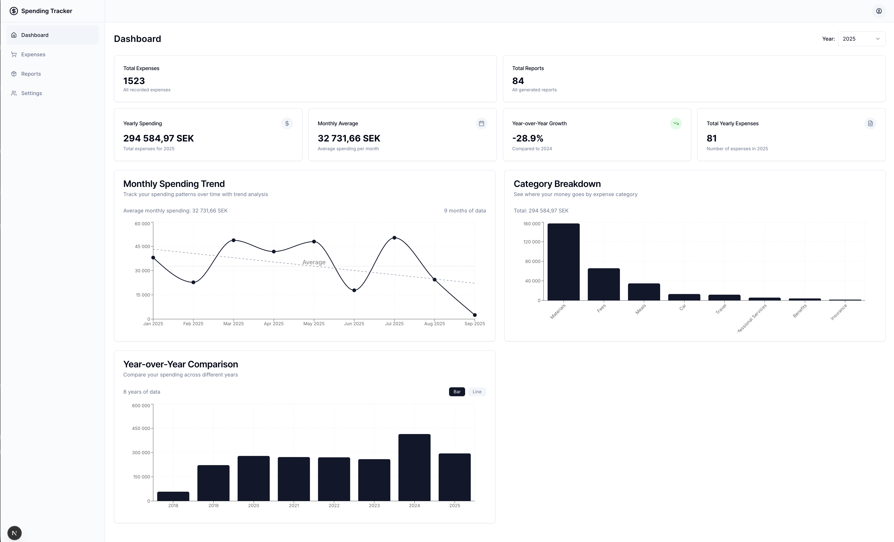
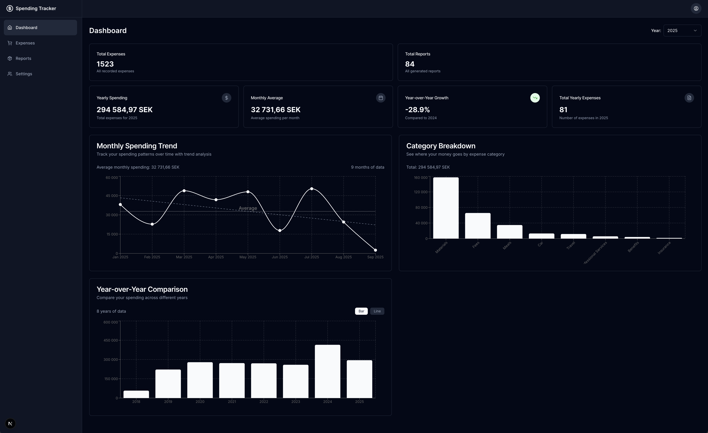

Spending tracker is a web application designed to help manage expenses with ease. It allows you to track, categorize, and visualize financial data across multiple currencies, making it simple to stay on top of your spending habits and create reports.

## Screenshots

### Dashboard (Light Theme)


### Dashboard (Dark Theme)


## Features

### 💰 Expense Management
- **Add Expenses**: Create expenses with merchant, amount, category, description, and date
- **Bulk Import**: Import expenses from CSV (Expesify) files for data migration
- **Multi-Currency Support**: Track expenses in multiple currencies (SEK, EUR, PLN, DKK) with automatic conversion
- **Expense Categories**: Organize expenses across 10 predefined categories:
  - Benefits, Car, Fees, Insurance, Materials, Meals, Professional Services, Rent, Travel, Utilities
- **Edit & Delete**: CRUD operations for expense management

### 📊 Analytics & Visualization
- **Dashboard Overview**: Statistics showing total expenses and reports
- **Interactive Charts**: 
  - Monthly spending trends
  - Category breakdown (pie charts)
  - Year-over-year comparisons
- **Spending Insights**: Analytics and spending patterns
- **Year Selection**: Filter data by specific years for detailed analysis

### 📋 Report Management
- **Create Reports**: Create expense reports
- **Report Details**: View expense breakdowns by category
- **Status Tracking**: Track report status (open/closed)

### 🌍 Multi-Currency & Exchange Rates
- **Real-time Exchange Rates**: Automatic currency conversion using external APIs
- **Rate Caching**: Caching of exchange rates (24-hour validity)
- **Base Currency**: SEK as default base currency with support for EUR, PLN, DKK

### 🎨 User Interface
- **Modern Design**: Clean, responsive interface built with Shadcn/ui components
- **Dark/Light Theme**: Theme switching support with next-themes
- **Mobile Responsive**: Optimized for different device sizes
- **Accessible**: Built with accessibility in mind using Radix UI primitives

## Technology Stack
Spending tracker is built using the following modern tech stack:

### Frontend
* **[Next.js 15.5.3](https://nextjs.org/docs/)**: React framework with App Router and Turbopack
* **[React 19.1.1](https://react.dev/)**: Latest React with concurrent features
* **[TypeScript 5.9.2](https://www.typescriptlang.org/)**: Type-safe development
* **[Tailwind CSS 4.1.13](https://tailwindcss.com/)**: Utility-first CSS framework
* **[Shadcn/ui](https://ui.shadcn.com/)**: Modern component library built on Radix UI
* **[Recharts 3.2.1](https://recharts.org/)**: Composable charting library
* **[React Hook Form 7.51.2](https://react-hook-form.com/)**: Performant forms with validation
* **[Zod 4.1.8](https://zod.dev/)**: TypeScript-first schema validation

### Backend & Database
* **[Kysely 0.28.5](https://kysely.dev/)**: Type-safe SQL query builder
* **[PostgreSQL](https://www.postgresql.org/)**: Robust relational database
* **[Node.js](https://nodejs.org/)**: JavaScript runtime for server-side operations

### Development Tools
* **[ESLint 9.35.0](https://eslint.org/)**: Code linting and formatting
* **[Prettier 3.2.5](https://prettier.io/)**: Code formatting with import organization
* **[Kysely Codegen](https://kysely.dev/docs/codegen)**: Automatic TypeScript types from database schema

## Database Schema

The application uses PostgreSQL with the following main tables:

### Expenses Table
- **id**: Primary key (serial)
- **report_id**: Foreign key to reports table (nullable)
- **merchant**: Merchant/vendor name
- **description**: Optional expense description
- **category**: Expense category (enum: Benefits, Car, Fees, etc.)
- **base_amount**: Amount in base currency (SEK)
- **base_currency**: Base currency (enum: SEK, EUR, PLN, DKK)
- **input_amount**: Original input amount
- **input_currency**: Original input currency
- **date**: Expense date
- **created_at**: Record creation timestamp

### Reports Table
- **id**: Primary key (serial)
- **name**: Report name
- **status**: Report status (enum: open, closed)
- **created_at**: Report creation timestamp

### Exchange Rates Table
- **id**: Primary key (serial)
- **from_currency**: Source currency
- **to_currency**: Target currency
- **rate**: Exchange rate value
- **created_at**: Rate timestamp

## Available Scripts

The project includes several utility scripts for database management and data import:

### Database Management
```bash
# Run database migrations
npm run db:migrate

# Rollback migrations
npm run db:down

# Generate TypeScript types from database schema
npm run db:generate-types

# Seed database with sample data
npm run db:seed
```

### Data Import
```bash
# Import expenses from CSV file
npm run import-expenses <csv-file-path> <report-name>
```

### Development
```bash
# Start development server with Turbopack
npm run dev

# Build for production
npm run build

# Start production server
npm run start

# Add new Shadcn/ui components
npm run shadcn:add

# Run linting
npm run lint
```

## Local Setup by Docker Compose

Project includes Dockerfile for all services together with Docker compose configuration.
Start the application using Docker Compose by running: `docker-compose up`

Following services are included:
* **spending-tracker**: Next js app hosted on: http://localhost:3000
* **postgresql**: PostgreSQL database with persistent volume
* **postgresql-adminer**: PHP tool for managing content in databases, hosted on: http://localhost:8081/


## Environment Setup

Before running the application, you need to create a `.env` file by copying the example file:

```bash
cp .env.example .env
```

Then edit the `.env` file with your specific configuration values.

## Project Structure

```
spending-tracker/
├── app/                    # Next.js App Router pages
├── components/             # React components
│   ├── dashboard/         # Dashboard and analytics components
│   ├── expenses/          # Expense management components
│   ├── reports/           # Report management components
│   ├── layout/            # Layout and UI components
│   └── ui/                # Shadcn/ui components
├── database/              # Database configuration and migrations
│   ├── migrations/        # Database schema migrations
│   └── seeders/           # Database seed data
├── lib/                   # Utility libraries and services
│   ├── actions/           # Server actions
│   ├── data/              # Data access layer
│   ├── schemas/           # Zod validation schemas
│   └── services/          # External services (exchange rates)
├── scripts/               # Utility scripts
├── types/                 # TypeScript type definitions
└── hooks/                 # Custom React hooks
```

